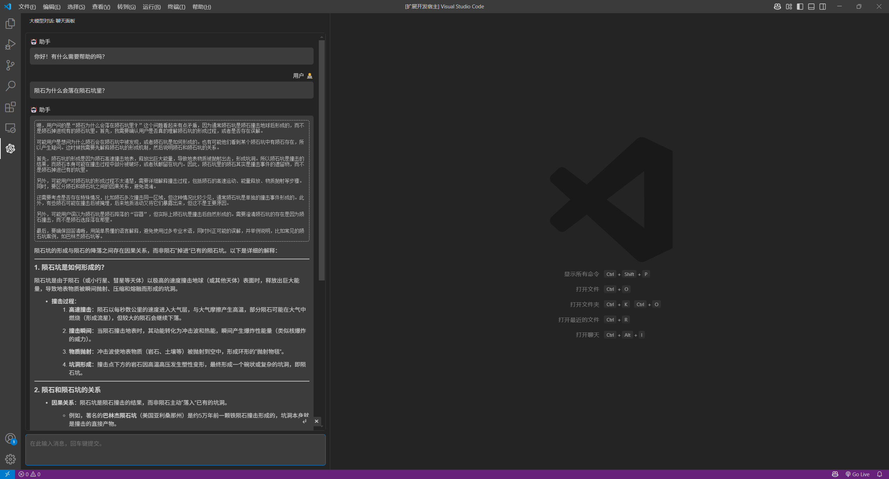

# llm-chat-vscode

一个 VSCode LLM 对话插件，支持接入 OpenAI 格式的 LLM API 接口。功能**极为简陋**，单纯是入门练习项目。

插件功能：

- 单纯的 LLM 对话框，未实现历史记录。
- 支持流式消息。
- 支持 Markdown 渲染。
- 支持显示推理大模型的思维过程。
- 支持编辑器右键菜单快速获取选取内容。

技术特性：

- 使用 OpenAI Node SDK 进行 API 调用。
- 对话框基于 VSCode Webview 实现。
- 通过 VSCode 设置读取 LLM 平台配置。
- 主题颜色使用 CSS 变量自适应。
- 本地化使用 VSCode 的 l10n 机制，支持中文/英文。